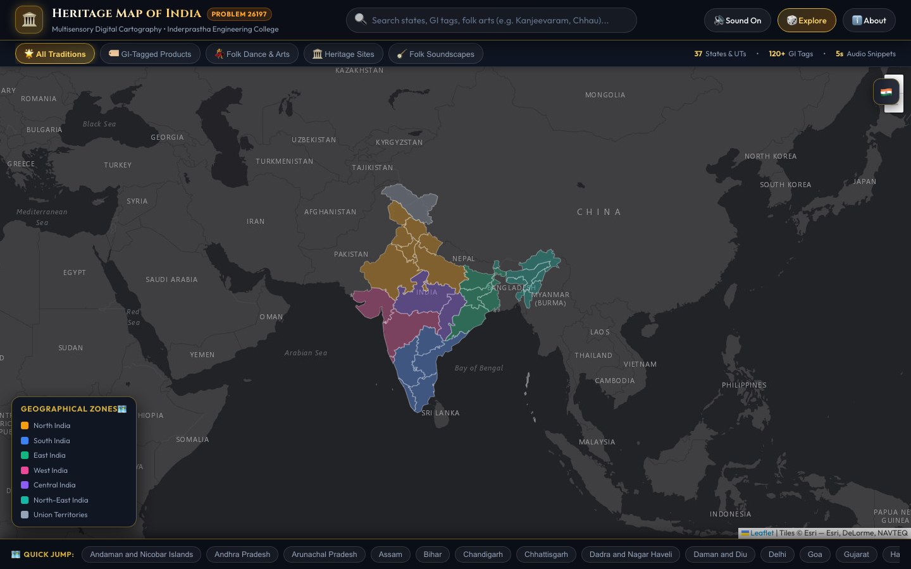
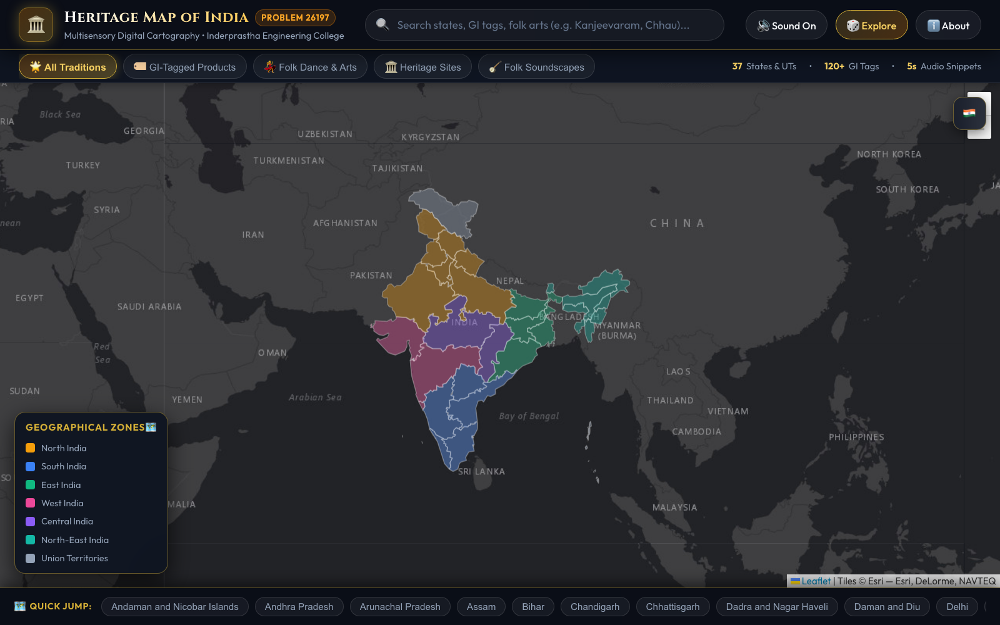

# Interactive Geographical Heritage Map of India 🇮🇳

[](https://mini-project-heritage-map-of-india.vercel.app/)
[](https://github.com/Manya-Goel132/Mini-Project-Heritage-Map-of-India)
[](https://opensource.org/licenses/MIT)
[](https://github.com/Manya-Goel132/Mini-Project-Heritage-Map-of-India)

> **College Mini-Project | Problem Statement 26197: Innovative ideas showcasing Indian traditions**  
> 🌐 **Live Web Application:** [https://mini-project-heritage-map-of-india.vercel.app](https://mini-project-heritage-map-of-india.vercel.app/)  
> 📁 **GitHub Repository:** [https://github.com/Manya-Goel132/Mini-Project-Heritage-Map-of-India](https://github.com/Manya-Goel132/Mini-Project-Heritage-Map-of-India)  
> **Student:** Manya Goel (University Roll No: `2400300100237`)  
> **Faculty Guide:** Ms. Disha  
> **Institution:** Inderprastha Engineering College (IPEC), Ghaziabad  
> **Affiliation:** Dr. A.P.J. Abdul Kalam Technical University (AKTU)

---

## 📖 Executive Summary & Abstract

Traditional educational media and static textbooks often reduce India's multi-millennial cultural legacy into detached, flat historical facts. They fail to evoke the living, spatial, and multisensory reality of Indian traditions.

The **Interactive Geographical Heritage Map of India** is a responsive, web-based digital cartography platform that bridges centuries of traditional heritage with modern front-end web engineering. By combining high-precision vector GIS polygons with an authentic regional soundscape engine, interactive Geographical Indication (GI) product registries, and traditional folk dance archives, this platform offers students, researchers, and cultural enthusiasts an intuitive, multisensory journey across all **37 States and Union Territories** of India.

---

## ⚡ Exact Technology Stack

In strict accordance with the project abstract and presentation specifications (PPT Slide 5):

| Layer | Technology | Implementation Details |
| :--- | :--- | :--- |
| **Markup & Semantics** | **HTML5** | Semantic, accessible DOM structure (`header`, `main`, `nav`, `footer`, ARIA roles). |
| **Styling & Aesthetics** | **CSS3 (Vanilla)** | Glassmorphism, CSS Custom Properties (Design Tokens), responsive Flexbox viewport architecture, smooth transitions. Zero heavy CSS frameworks. |
| **Logic & Interactivity** | **Vanilla JavaScript (ES6+)** | State management, search indexing, event delegation, audio synthesis, and modal lifecycle. |
| **Cartography & GIS** | **Leaflet.js (v1.9.4)** | Client-side interactive tile rendering, vector polygon GeoJSON layer parsing, dynamic hover/click boundaries. |
| **Spatial Dataset** | **GeoJSON (`data/india_states.geojson`)** | Comprehensive spatial coordinates for all 37 Indian States and Union Territories. |
| **Audio Subsystem** | **HTML5 Audio API** | Real field recordings, custom playback controller, **Forced Short-Play (5-second snippet engine)** with audio cue offsets and smooth volume fade-out. |
| **Basemap Provider** | **Esri World Dark Gray Canvas** | Free, high-contrast dark cartography with zero watermarks and zero external API key requirements. |

---

## 🌟 Core Features & System Capabilities

### 1. Interactive Vector Digital Cartography
- **All 37 States and UTs Mapped:** Clickable vector polygons rendered using Leaflet.js with clean boundaries and smooth hover effects.
- **7 Distinct Cultural Zones:** Region-coded styling representing North, South, East, West, Central, North-East, and Union Territories.
- **Dynamic Floating Legend:** Color-coded regional reference card that adapts seamlessly across all display sizes and zoom levels.

### 2. Multisensory 5-Second Traditional Soundscape Engine (PPT Slide 4)
- **Authentic Field & Studio Recordings:** Incorporates 17 verified traditional recordings sourced from the **Centre for Cultural Resources and Training (CCRT, Ministry of Culture, Govt. of India)**, **ICCR**, and **Wikimedia Commons** (e.g., Punjab Dhol & Algoze, Rajasthan Kamaicha & Khartal, Maharashtra Lavani Dholki, Kashmir Santoor & Rabab, Assam Bihu Pepa, Ladakh Tibetan Dungchen, Carnatic Flute & Veena).
- **Client-Side Forced Short-Play:** 
  - Complete, uncompressed audio tracks are preserved on disk.
  - An intelligent client-side playback controller starts playback at the musically rich section (`audioStartOffset`), tracks a live 5.0-second countdown, applies a smooth exponential volume fade in the final 800ms, and terminates playback precisely at 5.0 seconds.
  - Includes a user toggle between **⚡ 5s Forced Snippet** and **🎵 Full Track** mode.
- **Visual Equalizer Wave:** Real-time animated CSS sound equalizer and interactive progress bar indicating exact snippet duration.

### 3. Comprehensive Cultural Heritage Catalog
- **Geographical Indication (GI) Tags:** Over 120+ registered GI tags documented across Indian states (e.g., Kanjeevaram Silk, Darjeeling Tea, Naga Mircha, Kashmiri Pashmina, Pochampally Ikat, Aranmula Kannadi, Channapatna Toys, Blue Pottery of Jaipur).
- **Folk Dance & Arts:** Rich entries covering classical and regional folk traditions (Kathakali, Chhau, Garba, Rouf, Bihu, Yakshagana, Ghoomar, Cheraw, Kalbelia).
- **Cultural Narratives:** Curated historical backgrounds, state capitals, regional badges, and traditional instruments cataloged for every state.

### 4. Interactive Navigation & Exploration Tools
- **Instant Search with Autocomplete:** Real-time query filtering across state names, GI products, dance forms, and instruments with dropdown suggestions and auto-focus.
- **Layer Category Filters:** Switch views between *All Traditions*, *GI-Tagged Products*, *Folk Dance & Arts*, *Heritage Sites*, and *Folk Soundscapes*.
- **Quick-Jump State Carousel:** Bottom carousel bar displaying instant-navigation chips for all states and UTs.
- **Random State Explorer (🎲 Explore):** One-click discovery mode that pans the map and opens the heritage card for an unexplored Indian state.

### 5. Zoom-Resilient Responsive Architecture
- Rigid flex-column viewport architecture (`height: 100dvh`, zero window scrollbars) preventing layout shifts, overlap, or clipping.
- Rigorously tested and visually verified in Google Chrome across standard (100%), zoomed-out (67%), and zoomed-in (125%, 150%) states.

---

## 📸 Visual Showcase & Interface Previews

### 1. Standard Desktop Cartography View (100% Zoom)


### 2. Zoomed-In Interactive Perspective (125% Zoom)


### 3. Broad Cartography Overview (67% Zoom)


---

## 📁 Repository Directory Structure

```text
Interactive-Geographical-Heritage-Map/
│
├── index.html                   # Main entry point and semantic DOM layout
├── README.md                    # Comprehensive project documentation
├── .gitignore                   # Ignored files (system, logs, temp files)
├── Manya_Goel_Mini_Project_PPT.pdf      # Official academic presentation
├── Manya_Goel_Mini_Project_Abstract.pdf # Project synopsis and problem statement
│
├── css/
│   └── styles.css               # Complete design system, glassmorphism, responsive flex
│
├── js/
│   ├── app.js                   # Application controller, Leaflet logic, audio engine
│   └── stateData.js             # 37 states database (GI tags, dances, audios, summaries)
│
├── data/
│   └── india_states.geojson     # Vector boundary GeoJSON for all Indian States & UTs
│
├── docs/
│   └── screenshots/             # Interface showcase captures
│       ├── overview_desktop.png # Standard 100% desktop cartography view
│       ├── zoomed_out_view.png  # 67% broad cartography view
│       └── zoomed_in_view.png   # 125% focused state view
│
├── audio/                       # 55 Complete Regional Folk Audio Tracks
│   │
│   ├── # Authentic Field & Studio Recordings (CCRT, ICCR & Wikimedia)
│   ├── assam_real.mp3           # Bihu dhol, pepa horn & taal
│   ├── bansuri_real.ogg         # Traditional Indian bamboo bansuri
│   ├── carnatic_concert_real.ogg# South Indian classical ensemble (Veena, Flute, Mridangam)
│   ├── gujarat_garba_real.mp3   # Authentic Gujarati garba dhol & shehnai
│   ├── kashmir_santoor_real.mp3 # Kashmiri sufi santoor & rabab
│   ├── kerala_real.ogg          # Sopana sangeetham & chenda melam
│   ├── ladakh_tibetan_real.ogg  # Buddhist monastery dungchen horns & cymbals
│   ├── maharashtra_real.ogg     # Lavani dholki & lejim
│   ├── manipur_real.mp3         # Manipuri pung cholom & pena
│   ├── odisha_real.mp3          # Odissi mardala & flute
│   ├── punjab_real.wav          # Punjab folk dhol & boliyan
│   ├── rajasthan_real.ogg       # Desert folk kamaicha & sarangi
│   ├── tamil_nadu_real.ogg      # Nadaswaram & thavil temple soundscape
│   ├── tribal_folk_real.mp3     # Central Indian mandri & madal drumming
│   ├── uttar_pradesh_real.wav   # Braj Holi folk rasia & harmonium
│   ├── uttarakhand_real.ogg     # Kumaoni & Garhwali dhol-damau
│   ├── west_bengal_real.mp3     # Baul folk ektara & dotara
│   │
│   └── # State & Union Territory Regional Acoustic Soundscapes
│       ├── andaman_and_nicobar_islands.wav
│       ├── andhra_pradesh.wav
│       ├── arunachal_pradesh.wav
│       ├── assam.wav
│       ├── bihar.wav
│       ├── chandigarh.wav
│       ├── chhattisgarh.wav
│       ├── dadra_and_nagar_haveli.wav
│       ├── dadra_and_nagar_haveli_and_daman_and_diu.wav
│       ├── daman_and_diu.wav
│       ├── delhi.wav
│       ├── goa.wav
│       ├── gujarat.wav
│       ├── haryana.wav
│       ├── himachal_pradesh.wav
│       ├── jammu_and_kashmir.wav
│       ├── jharkhand.wav
│       ├── karnataka.wav
│       ├── kerala.wav
│       ├── ladakh.wav
│       ├── lakshadweep.wav
│       ├── madhya_pradesh.wav
│       ├── maharashtra.wav
│       ├── manipur.wav
│       ├── meghalaya.wav
│       ├── mizoram.wav
│       ├── nagaland.wav
│       ├── odisha.wav
│       ├── puducherry.wav
│       ├── punjab.wav
│       ├── rajasthan.wav
│       ├── sikkim.wav
│       ├── tamil_nadu.wav
│       ├── telangana.wav
│       ├── tripura.wav
│       ├── uttar_pradesh.wav
│       ├── uttarakhand.wav
│       └── west_bengal.wav
│
└── vendor/
    └── leaflet/                 # Local Leaflet v1.9.4 distribution (with CDN fallback)
        ├── leaflet.js
        └── leaflet.css
```

---

## 🚀 Live Demo & Local Setup

### 🌐 Live Deployment
The interactive web map is live on Vercel:  
👉 **[https://mini-project-heritage-map-of-india.vercel.app](https://mini-project-heritage-map-of-india.vercel.app/)**

---

### Local Setup
The project is completely self-contained and requires **zero external build tools or node modules**. It runs directly on any modern browser supporting HTML5 and ES6.

### 1. Clone the Repository
```bash
git clone https://github.com/Manya-Goel132/Mini-Project-Heritage-Map-of-India.git
cd Mini-Project-Heritage-Map-of-India
```

### 2. Launch Local Server

#### Option A: Using Python (Recommended)
Open your terminal in the cloned repository directory and run:

```bash
# Python 3
python3 -m http.server 8080
```

Then open your browser and navigate to:
```text
http://localhost:8080
```

#### Option B: Using Node.js / npx
```bash
npx serve -l 8080 .
```

#### Option C: Using VS Code Live Server
- Install the **Live Server** extension in VS Code.
- Right-click `index.html` and click **"Open with Live Server"**.

---

## 🎨 Cultural Data & Audio Attributions

1. **Audio Recordings:** Sourced under Open Cultural & Creative Commons licenses from:
   - *Centre for Cultural Resources and Training (CCRT)*, Ministry of Culture, Government of India.
   - *Indian Council for Cultural Relations (ICCR)* archives.
   - *Wikimedia Commons Audio Archives* (Traditional Indian Folk Music repositories).
2. **Geographical Indications (GI):** Validated against official records of the *Intellectual Property India (Geographical Indications Registry)* under the Department for Promotion of Industry and Internal Trade (DPIIT), Ministry of Commerce and Industry.
3. **Cartography Basemap:** World Dark Gray Canvas powered by *Esri, DeLorme, NAVTEQ*.
4. **Typography:** *Cinzel* (Serif display for traditional Indian titles) and *Outfit* (Sans-serif for crisp legibility), served via Google Fonts.

---

## 🎓 Academic Attribution

This project is submitted in partial fulfillment of the requirements for the **Mini-Project** curriculum at **Inderprastha Engineering College (IPEC)**, Ghaziabad.

- **Student:** Manya Goel
- **University Roll Number:** `2400300100237`
- **Problem Statement ID:** `26197`
- **Faculty Guide:** Ms. Disha
- **Live Web Application:** [https://mini-project-heritage-map-of-india.vercel.app](https://mini-project-heritage-map-of-india.vercel.app/)
- **GitHub Repository:** [Manya-Goel132/Mini-Project-Heritage-Map-of-India](https://github.com/Manya-Goel132/Mini-Project-Heritage-Map-of-India)

---

## 📄 License

This project is created for educational and academic research purposes under the **MIT License**. All cultural recordings and GI tag logos remain the intellectual and cultural heritage of their respective communities and sovereign government authorities.
